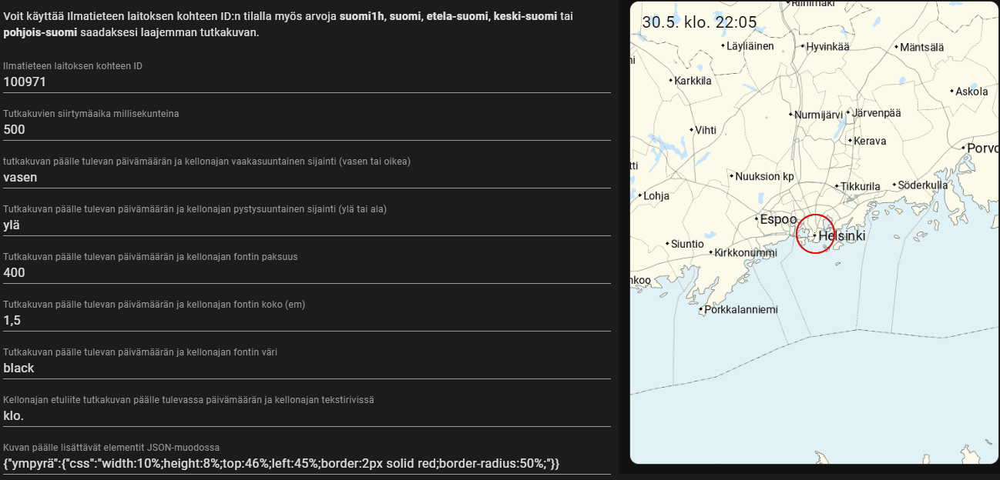

# Ilmatieteen laitoksen sadetutka- ja salamahavainnot Home Assistantiin
Home Assistant -kortti, joka näyttää Ilmatieteen laitoksen sadetutkan ja salamahavainnot kuvaesityksenä kojelaudalla.

## Asennus
### HACS
Lisää HACSin frontend-puolelle mukautettu repo <b>kosmosnautti/ha-fmi-radar</b> kategoriaan <b>lovelace</b> ja asenna HACSista sen jälkeen "Ilmatieteen laitoksen sadetutka- ja salamahavainnot".
### Käsin
1. Kopioi <b>fmi-radar.js</b> -tiedosto Home Assistantin /config/www -polkuun
2. Avaa Home Assistantin <b>asetukset</b> ja sen alta <b>kojelaudat</b>
3. Klikkaa oikeasta yläkulmasta löytyvää kolmen pisteen kuvaketta ja valitse avautuvasta valikosta <b>resurssit</b>
4. Klikkaa <b>lisää resurssi</b> -painiketta
5. Aseta avautuvasta ikkunasta URLiksi <b>/local/fmi-radar.js</b>, valitse tyypiksi <b>JavaScript-moduuli</b> ja klikkaa <b>luo</b>

## Ilmatieteen laitoksen kohteen IDn selvittäminen
Konfiguroinnissa tarvittavan kohteen IDn selvitys onnistuu siirtymällä selaimella osoitteeseen https://ilmatieteenlaitos.fi/ ja hakemalla hakukentästä sääennuste halutulle sijainnille. Kun ennustesivu avautuu, rullaa kohtaan <b>Sadetutka- ja salamahavainnot</b>. Klikkaa tutkakuvan päällä hiiren oikealla painikkeella ja valitse <b>Avaa kuva uudessa välilehdessä</b> (kielestä ja selaimesta riippuen). Selaimen osoiteriviltä näet avautuvan kuvan URL-osoitteen noudattelevan seuraavanlaista kaavaa:

`https://cdn.fmi.fi/weather-observations/products/radar-tiles/station_100971/...`

Tässä esimerkkiosoitteessa näkyvä numero <b>100971</b> on haluttu kohteen ID, jota käytetään kortin konfiguroinnissa.

<b>Huom! Jos haluat laajempia tutkakuvia, tarkan kohteen IDn haku edellä mainitulla tavalla ei ole välttämätöntä. Voit käyttää kohteen IDnä myös seuraavan taulukon arvoja:</b>

| Kohteen ID    | Määritelmä                                      |
| ------------- | ----------------------------------------------- |
| suomi1h       | Koko Suomen sadetutka 1 h aikavälillä + ennuste |
| suomi         | Koko Suomen sadetutka 15 min aikavälillä        |
| etela-suomi   | Etelä-Suomen sadetutka 15 min aikavälillä       |
| keski-suomi   | Keski-Suomen sadetutka 15 min aikavälillä       |
| pohjois-suomi | Pohjois-Suomen sadetutka 15 min aikavälillä     |

## Käyttö
Lisää kojelautaan uusi kortti ja valitse korttiluettelosta <b>Mukautettu: Ilmatieteen laitoksen sadetutka- ja salamahavainnot</b>. Kortti sisältää visuaalisen editorin jolla pystyy muokkaamaan kaikkia kortin tarjoamia ominaisuuksia.
